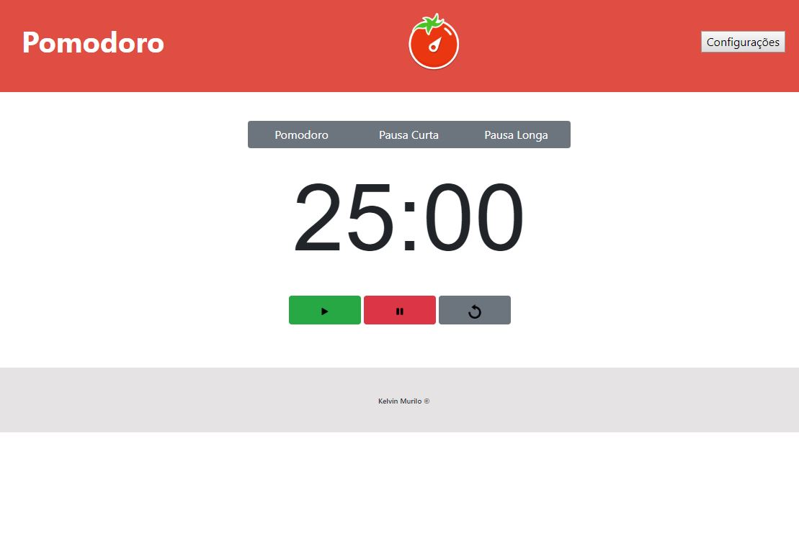

<h1>Pomodoro Timer</h1>

A Técnica Pomodoro é um método de gerenciamento de tempo desenvolvido por Francesco Cirillo no final dos anos 1980. O Pomodoro consiste na utilização de um cronômetro para dividir o trabalho em períodos de 25 minutos, separados por breves intervalos.

Fonte: 
<a href="https://pt.wikipedia.org/wiki/T%C3%A9cnica_pomodoro">Wikipédia</a>

<h2>Objetivo</h2>

Este projeto está sendo executado para colocar em prática os conhecimentos adquiridos em JavaScript.

<h2>Tela</h2>
<<<<<<< HEAD

=======

>>>>>>> ff6a5650d359e3e13481f25d64e3a091cfc93acc
